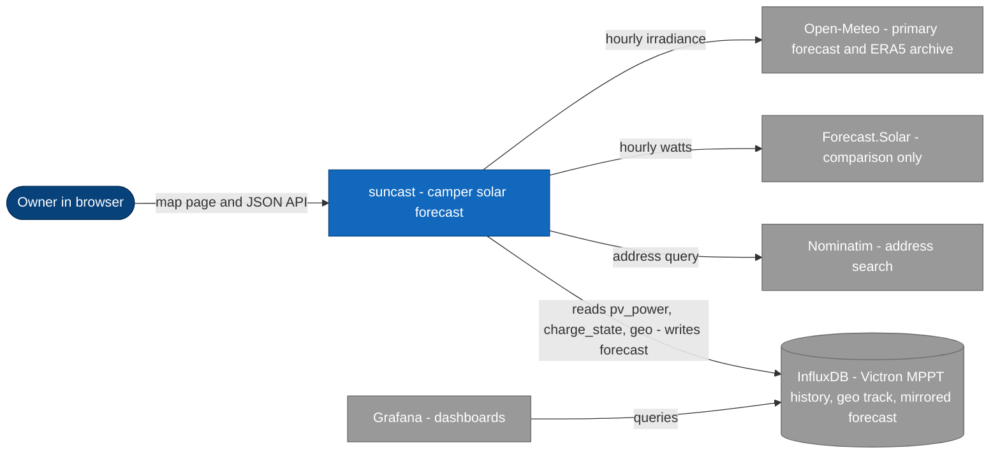
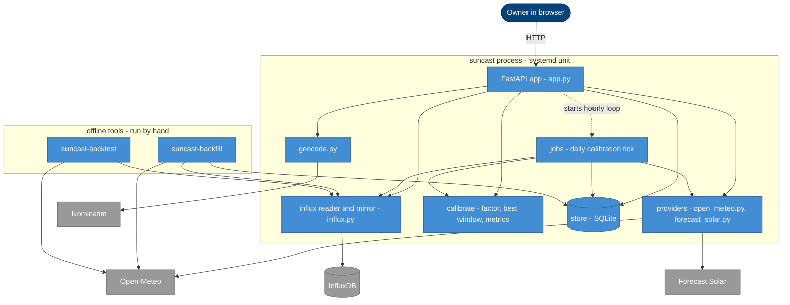
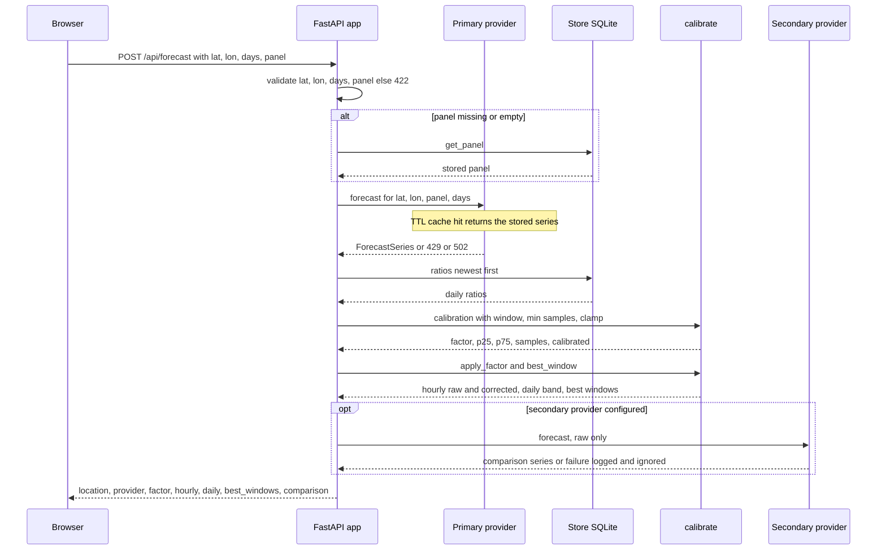
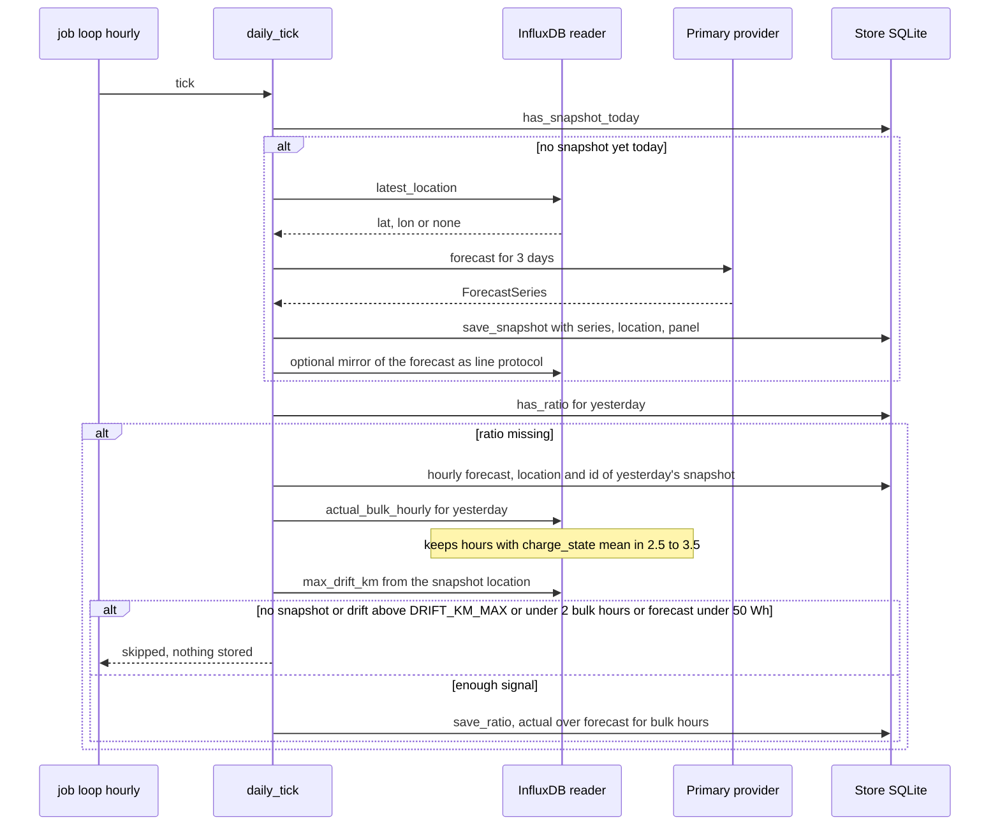

# Architecture

Every statement refers to the code in `suncast/`; the module is named where it matters.

## 1. Introduction and goals

suncast forecasts the solar yield of the camper's rooftop PV array for a location and a panel
configuration, hourly and per day, up to 16 days ahead. It shows the forecast on a map and
corrects it with a factor learned from the Victron MPPT history.

| Goal | What it means |
|---|---|
| Useful forecast | Open-Meteo's regional irradiance model as the primary series, converted to panel watts |
| Honest correction | Learn only from hours that carry signal (bulk charge), show raw and corrected together |
| Works on the camper | One small process on the buspi Raspberry Pi, state in one SQLite file |
| Visible in Grafana | The forecast is mirrored into InfluxDB next to the measured values |

Stakeholder: the owner, who plans power use from the browser and watches Grafana.

## 2. Constraints

- Runs on buspi (Raspberry Pi, Python 3.13 in production, the code supports 3.11 and newer).
- Configuration through environment variables only, read once at start (`suncast/config.py`).
- Inputs come from InfluxDB, which already holds the Victron MPPT history
  (`pv_power`, `charge_state`) and the location track `geo` written by other buspi services.
- Free provider APIs only. Open-Meteo needs no key, Forecast.Solar is rate limited.
- No separate database server and no job scheduler: SQLite and an in-process loop.
- Secrets (the InfluxDB token) come from `/etc/buspi/secrets.env`, never from the repository.

## 3. Context and scope

| Neighbour | Direction | Detail |
|---|---|---|
| Browser | in | Pages `/` and `/history`, JSON under `/api/` |
| Open-Meteo | out | `api.open-meteo.com` forecast (primary), `archive-api.open-meteo.com` ERA5 for the offline tools |
| Forecast.Solar | out | `api.forecast.solar` estimate, shown for comparison, never calibrated |
| Nominatim | out | `nominatim.openstreetmap.org` search with a descriptive User-Agent, one shot per search |
| InfluxDB | in and out | Flux queries for Victron and `geo` data, line-protocol writes of the forecast |
| Grafana | indirect | Reads the mirrored `solar_forecast` measurement from InfluxDB, suncast never talks to it |

The primary provider is selected by `PROVIDER` (`open_meteo` or `forecast_solar`), the secondary
by `PROVIDER_SECONDARY` (empty disables it).

## 4. Solution strategy

| Problem | Approach | Where |
|---|---|---|
| Provider output is biased | Rolling median of daily actual/forecast ratios, applied as one factor | `calibrate.py` |
| Actuals are distorted by a full battery | Compare bulk-charge hours only | `influx.py`, `jobs.py` |
| A travel day compares against the wrong sky | Skip days where the van roamed beyond `DRIFT_KM_MAX` | `jobs.py` |
| The past cannot be refetched | Store every daily forecast as a snapshot, calibrate from snapshots | `store.py` |
| Providers fail or throttle | A TTL cache per provider, the secondary is best effort | `providers/`, `app.py` |
| Testability without network | Pure parse functions, fetch and query functions injected | all modules |

## 5. Building blocks

| Block | Responsibility | Module |
|---|---|---|
| FastAPI app | Routes, request validation, composition of provider, calibration and secondary comparison, starts the job loop in its lifespan | `app.py` |
| Providers | `OpenMeteo` (irradiance to watts, `panel_wp * GTI / 1000`, capped at `charger_limit_w`) and `ForecastSolar`, both with a TTL cache (`SUNCAST_CACHE_TTL_S`), raising `RateLimited` (429) and `ProviderError` | `providers/` |
| Calibrate | `calibration()` median, quartiles and clamp, `apply_factor()`, `best_window()`, `metrics()` | `calibrate.py` |
| Jobs | `daily_tick()`: one snapshot per day, then yesterday's ratio. Runs from `_job_loop` at start and then every 3600 s | `jobs.py` |
| Store | SQLite with the tables `snapshots`, `ratios` and `panel` (one row), WAL mode, one `RLock` | `store.py` |
| Influx reader and mirror | Flux queries (latest location, bulk hours, drift) and line-protocol output of the forecast | `influx.py` |
| Geocode | Nominatim search, parsed to `{label, lat, lon}` | `geocode.py` |
| Offline tools | `suncast-backfill` writes ERA5 expected PV to InfluxDB, `suncast-backtest` scores PV models and writes a markdown table. Not part of the service, see  | `backfill.py`, `backtest.py`, `pvmodel.py` |

Dependency direction: `app.py` and the tools depend on the other modules, `calibrate.py`,
`models.py` and `pvmodel.py` are pure.

## 6. Runtime view

### 6.1 Forecast request with calibration applied

### 6.2 Daily calibration tick

`_job_loop` calls `daily_tick()` at start and then every hour. Both phases are idempotent per
day, so the repeated calls do nothing once the day's work exists.

Failures of a phase are logged and returned as `skipped`, they never stop the loop.

## 7. Deployment

```mermaid
flowchart TB
    subgraph buspi["buspi - Raspberry Pi"]
        subgraph unit["systemd unit suncast.service, user pi"]
            proc["suncast process in suncast-env, port 8090"]
        end
        env["/etc/buspi/suncast.env and /etc/buspi/secrets.env"]
        db[("/var/lib/suncast/suncast.db")]
        influx[("InfluxDB, port 8086")]
        grafana["Grafana"]
    end
    internet["Open-Meteo, Forecast.Solar, Nominatim"]
    browser(["Owner's browser on the LAN"])

    env -->|"EnvironmentFile"| proc
    proc --> db
    proc --> influx
    grafana --> influx
    proc -->|"HTTPS"| internet
    browser -->|"HTTP"| proc

    classDef person fill:#08427b,stroke:#052e56,color:#fff
    classDef container fill:#438dd5,stroke:#2e6295,color:#fff
    classDef external fill:#999999,stroke:#6b6b6b,color:#fff
    class browser person
    class proc container
    class influx,grafana,internet,env,db external
```

The unit (`deploy/suncast.service`) runs `/home/pi/suncast-env/bin/suncast` as user `pi` with
`Restart=always`, after `network-online.target` and `influxdb.service`. The two environment
files hold the configuration, the token lives only in `secrets.env`. Steps: .

## 8. Crosscutting concepts

- **Configuration:** a fixed set of environment variables, parsed once into a dataclass,
  documented once in .
- **Time:** all timestamps and day boundaries are UTC. Providers are asked for `timezone=UTC`.
  `SUNCAST_TZ` is read into the configuration but no code path uses it today.
- **Persistence:** SQLite for snapshots, ratios and the panel, InfluxDB only for reads and for
  the display mirror. SQLite is the source of truth for calibration.
- **Dependency injection:** providers take a `fetch` function, the Influx reader a `query`
  function, jobs a `Deps` bundle with a clock. Tests run without network.
- **Errors:** provider errors map to HTTP 429 or 502, the secondary provider and the InfluxDB
  mirror are best effort and only logged, job phases degrade to a `skipped` reason.
- **Caching:** each provider keeps an in-memory cache keyed by rounded location, panel and
  days, valid for `SUNCAST_CACHE_TTL_S`.
- **Logging:** the standard `logging` module. Errors reach journald through the unit's stderr.

## 9. Decisions

| Decision | Reason |
|---|---|
| Open-Meteo is primary, Forecast.Solar secondary | Open-Meteo has a 16 day horizon, no key and a regional model. Forecast.Solar is kept as an independent sanity check |
| Calibrate on bulk hours only | Throttled hours measure the battery, not the panel |
| Median with a clamp, not a mean | Robust against odd days. The clamp bounds the damage of a bad window |
| Snapshots in SQLite | Forecast.Solar serves no past data, and a past forecast cannot be recreated for the real daytime location |
| Skip travel days | A forecast for the overnight spot says nothing about the sky the van drove under |
| In-process hourly loop instead of cron | One unit to run and restart, the work is idempotent per day |
| Mirror forecast to InfluxDB for Grafana | The measured values already live there |
| Mermaid for diagrams | Rendered in the browser, no server and no Java |

## 10. Quality

| Quality | How it is met |
|---|---|
| Correctness of the numbers | Pure modules (`calibrate`, `models`, providers' parsers) with a coverage gate of 85 percent in CI |
| Testability | Injected fetch, query and clock, a synthetic fixture set in `tests/` |
| Robustness | One failing day, provider or write never stops the service or an offline run |
| Operability | `GET /api/health`, journald logs, `Restart=always` |
| Reproducible builds | `uv.lock` with `uv sync --locked` in CI |

## 11. Risks and technical debt

- **Mirror ignores calibration settings.** The forecast mirror in `daily_tick()` calls
  `calibration()` with its defaults (30 days, 5 samples, clamp 0.3 to 1.3), not with the
  `SUNCAST_*` values the API uses. With non-default settings, `corrected_w` in InfluxDB can
  differ from the API's corrected curve.
- **`SUNCAST_TZ` is unused.** It is parsed but nothing reads it, see section 8.
- **Mirror target.** The forecast is written to the Victron bucket (`VICTRON_BUCKET`), not to a
  bucket of its own, so the token needs write access there.
- **No authentication.** The API trusts the LAN.
- **Single process and single SQLite file.** Running two instances against one database would
  double the snapshot work.
- **Provider limits.** Forecast.Solar rate limits show up as a missing `comparison` block.
- **Missing location.** Without a `geo` fix the daily snapshot is skipped with `no_location`,
  and no calibration data accumulates.

## 12. Glossary

| Term | Meaning |
|---|---|
| Bulk hour | An hour whose mean `charge_state` is at least 2.5 and below 3.5, the MPPT is not throttled |
| Calibration factor | Median of the daily actual/forecast ratios, clamped, applied to the primary forecast |
| Snapshot | A stored forecast (hourly and daily series, location, panel) taken once per UTC day |
| Ratio | `actual_wh / forecast_wh` over the bulk hours of one day |
| GTI | Global tilted irradiance in W/m2, Open-Meteo's panel-plane irradiance |
| ERA5 | Reanalysis of past weather, used only by the offline tools |
| MPPT | Maximum power point tracker, the Victron solar charger |
| buspi | The Raspberry Pi in the camper that hosts the services |
